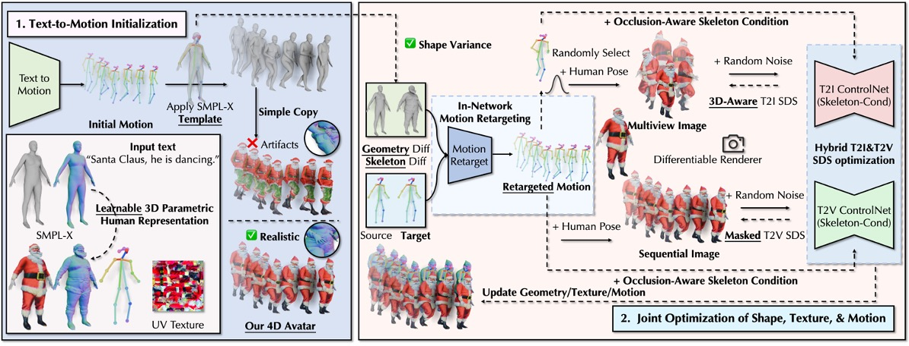

<p align="center">
<h2 align="center">&#127775; STAR: Skeleton-aware Text-based 4D Avatar Generation with In-Network Motion Retargeting</h2>
<h3 align="center"><a href="https://arxiv.org/abs/2406.04629">arXiv Preprint</a> | <a href="https://star-avatar.github.io/">Project Page</a></h3>
<p align="center">
<a href="https://zenghaochai.com/"><strong>Zenghao Chai</strong></a>
|  
<a href="https://www.chentang.cc/#"><strong>Chen Tang</strong></a>
|
<a href="https://sites.google.com/site/yongkangwong"><strong>Yongkang Wong</strong></a>
|
<a href="https://www.comp.nus.edu.sg/~mohan/"><strong>Mohan Kankanhalli</strong></a>
</p>


# Abstract
The creation of 4D avatars (i.e., animated 3D avatars) from text description typically uses text-to-image (T2I) diffusion models to synthesize 3D avatars in the canonical space and subsequently applies animation with target motions. However, such an optimization-by-animation paradigm has several drawbacks. (1) For pose-agnostic optimization, the rendered images in canonical pose for naive Score Distillation Sampling (SDS) exhibit domain gap and cannot preserve view-consistency using only T2I priors, and (2) For post hoc animation, simply applying the source motions to target 3D avatars yields translation artifacts and misalignment. To address these issues, we propose <strong>S</strong>keleton-aware <strong>T</strong>ext-based 4D <strong>A</strong>vatar generation with in-network motion <strong>R</strong>etargeting (STAR). STAR considers the geometry and skeleton differences between the template mesh and target avatar, and corrects the mismatched source motion by resorting to the pretrained motion retargeting techniques. With the informatively retargeted and occlusion-aware skeleton, we embrace the skeleton-conditioned T2I and text-to-video (T2V) priors, and propose a hybrid SDS module to coherently provide multi-view and frame-consistent supervision signals. Hence, STAR can progressively optimize the geometry, texture, and motion in an end-to-end manner. The quantitative and qualitative experiments demonstrate our proposed STAR can synthesize high-quality 4D avatars with vivid animations that align well with the text description. Additional ablation studies shows the contributions of each component in STAR.



# Installation

## Prerequisite
- System requirement: Ubuntu
- Tested GPU: A100 (40GB)

## Install Packages
```bash
git clone https://github.com/czh-98/STAR.git
cd STAR 

# create env
conda create -n star python=3.9.18

conda activate star 

# install pytorch
conda install pytorch==1.12.1 torchvision==0.13.1 torchaudio==0.12.1 cudatoolkit=11.6 -c pytorch -c conda-forge

# install pytorch3d
conda install -c fvcore -c iopath -c conda-forge fvcore iopath
conda install -c bottler nvidiacub
conda install pytorch3d -c pytorch3d

# install other dependencies
pip install -r requirements.txt

# install mmcv
pip install -U openmim
mim install mmcv==1.7.0

# install xformer
conda install xformers -c xformers

# install smplx
cd tada_smplx
python setup.py install 

cd ..
```

## Data

- Follow the instruction of [MotionDiffuse](https://github.com/mingyuan-zhang/MotionDiffuse), download the pretrained model [t2m.zip](https://drive.google.com/file/d/1VVzvuoS8Vwk4tBMM16Ca9eb3KkMamA5F/view?usp=drive_link), unzip them and save at directory `./data/`.

- Follow the instruction of [TADA](https://tada.is.tue.mpg.de/), register, and download the
[TADA Extra Data](https://download.is.tue.mpg.de/download.php?domain=tada&resume=1&sfile=tada_extra_data.zip), unzip them and save at directory `./data/`.

- Follow the instruction of [FLAME](https://flame.is.tue.mpg.de/), register, and download the [FLAME Vertex Masks](https://files.is.tue.mpg.de/tbolkart/FLAME/FLAME_masks.zip), and [FLAME Mediapipe Landmark Embedding](https://files.is.tue.mpg.de/tbolkart/FLAME/mediapipe_landmark_embedding.zip), unzip them and save at directory `./data/`.

- Finally, the data should then be organized as:

```
data
├── FLAME_masks
│   ├── FLAME_masks.gif
│   ├── FLAME_masks.pkl
│   ├── FLAME.obj
│   └── readme
├── init_body
│   ├── data.npz
│   ├── data-remesh2.npz
│   ├── fit_smplx_dense_lbs_weights.npy
│   ├── fit_smplx_dense_unique.npy
│   ├── fit_smplx_dense_uv.npz
│   ├── fit_smplx_params.npz
│   └── mesh_uv.npz
├── mediapipe
│   └── face_landmarker.task
├── mediapipe_landmark_embedding
│   ├── mediapipe_landmark_embedding.npz
│   └── readme
├── smplx
│   ├── FLAME_masks.pkl
│   ├── FLAME_SMPLX_vertex_ids.npy
│   ├── smplx_faces.npy
│   ├── smplx_lbs_weights.npy
│   ├── SMPLX_MALE.npz
│   ├── SMPLX_NEUTRAL_2020.npz
│   ├── smplx_param.pkl
│   ├── smplx_to_smpl.pkl
│   ├── smplx_uv_map
│   ├── smplx_uv.npz
│   ├── smplx_uv.obj
│   └── smplx_vert_segementation.json
├── t2m
│   └── t2m_motiondiffuse
│       ├── meta
│       │   ├── mean.npy
│       │   └── std.npy
│       ├── model
│       │   └── latest.tar
│       └── opt.txt
└── talkshow
    ├── rich.npy
    └── rich.wav
```

</details>

 
# Usage 

## Training 

- The results will be saved in workspace (`./exp` in default). You may edit the default path in the `config/*.yaml` files.
```python 
python -m apps.run --config configs/train.yaml --text "Tyrion Lannister in Game of Thrones wearing black leather jacket, he/she is performing extreme acrobat while raising hands and kicking quickly" --description demo --t2m_model mdiffuse
``` 

## Testing

- Once the avatar is optimized, it is ready to be animated of arbitrary motions to produce 4D contents.

```python
python -m apps.demo --config configs/test.yaml --text "Tyrion Lannister in Game of Thrones wearing black leather jacket, he/she is performing extreme acrobat while raising hands and kicking quickly" --description demo --t2m_model mdiffuse
```


### Export Fbx

- TBD


# Citation
If you find our work is helpful in your research, please cite:

```bibtex
@misc{chai2024star,
  author = {Chai, Zenghao and Tang, Chen and Wong, Yongkang and Kankanhalli, Mohan},
  title = {STAR: Skeleton-aware Text-based 4D Avatar Generation with In-Network Motion Retargeting},
  eprint={2406.04629},
  archivePrefix={arXiv},
  year={2024},
}
```


# Acknowledgement

This repository is heavily based on [TADA](https://github.com/TingtingLiao/TADA), [DreamWaltz](https://github.com/IDEA-Research/DreamWaltz), [ConditionVideo](https://github.com/pengbo807/ConditionVideo), [R2ET](https://github.com/Kebii/R2ET), [MotionDiffuse](https://github.com/mingyuan-zhang/MotionDiffuse.git), [MMHuman3D](https://github.com/open-mmlab/mmhuman3d). We would like to thank the authors of these work for publicly releasing their code.


